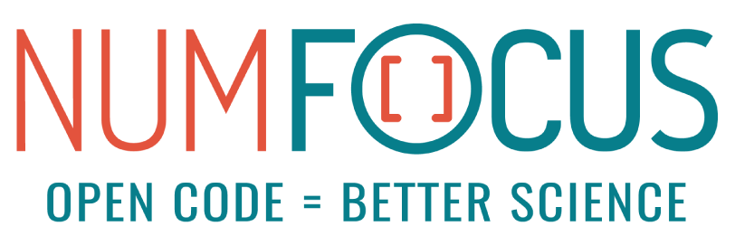
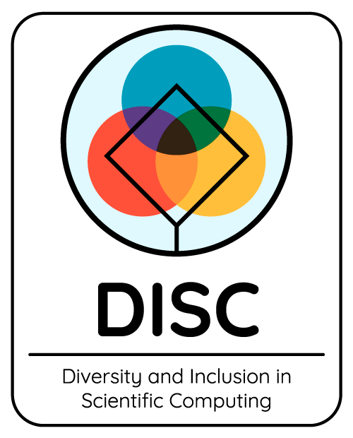

# Diversity and Inclusion Conversation Kit

#### _How to start the diversity and inclusion conversation at your company_

**[CLICK HERE TO VIEW PAGE AS HTML](http://htmlpreview.github.com/?https://github.com/numfocus/diversity-and-inclusion-conversation-kit/blob/master/guide.html)**

At the [Diversity and Inclusion in Scientific Computing (DISC) Unconference](https://pydata.org/nyc2017/diversity-inclusion/disc-unconference-2017/), our group focused on ways to start and maintain conversations about diversity and inclusion in the workplace. Our product for the two-day unconference was this quick start guide and a set of D&I Big Talk cards[[13](#r-13)].

The Conversation Quick Start Kit was built from a variety of online resources, as well as input from other attendees at the unconference. There were three main questions framing the discussion:
  1. How can I have a conversation with a coworker/friend about offensive comments without making them defensive?
  1. When is the right time to have that conversation and how do I create a safe space for them to be willing to see my perspective?
  1. After the starting conversation, how do I ensure that it progresses organically?

The D&I Big Talk cards were inspired by Kalina Silverman’s _[Make Big Talk Experiment](http://www.makebigtalk.com/)_. They are organized into three different levels, with the intention of being used over a series of small group or one-on-one meetings, progressing from level 1 to level 3. If you have suggestions for additional questions, please submit them [here](https://docs.google.com/forms/d/e/1FAIpQLSf4mDz0Ovfs2Bb3Hrd2VJPUjLGpmJypKngTQTjcrS-rgDqhlQ/viewform).

Overall the DISC Unconference provided a fantastic venue for connecting with others who are also actively working to promote diversity and inclusion in the scientific computing community.

-----

### Table of Contents
  1. [Get buy-in from your coworkers and leadership](#buy-in)
  1. [Start the conversation: guidelines on productive conversations](#start-convo)
  1. [Keep the conversation going](#cont-convo)
  1. [References](#references)
  1. [Additional Resources](#more-resources)

-----

###  Get buy-in from your coworkers and leadership
  - Why is diversity and inclusion important?[[1](#r-1)]
    - Bottom line: Diverse companies perform better financially, especially when women hold top leadership positions
    - Retention: Diverse teams show better productivity and rapport, and have higher employee retention
    - Culture: Diverse companies demonstrate a higher rate of innovation and productivity

###  Start the conversation: guidelines on productive conversations
- Establish a safe space:
    - No feigning surprise
        - “You’ve never watched Star Wars?!”
    - No unhelpful corrections
        - “Well actually, it’s not PE-can, it’s pe-CAN”
    - No interrupting
    - No such thing as ‘dumb questions’
    - Allow anonymous questions
    - Always be inclusive
    - Having the facilitator share a personal example of their own transgression(s) can help build rapport and trust within the group to encourage others to share.
- State the topic
    - Show a video/movie, read an article/book together, listen to a podcast, or present a topic and ask participants to bring resources
- Define, discuss, share
  - Why is the topic important?
  - How has the topic affected you or your co-workers?
  - What are some ways we as a company/team can improve regarding this topic?

- Topic Ideas
  - Intersectionality
  - Privilege[[2](#r-2), [14](#r-14)]
  - Microaggressions[[3](#r-3)]
  - Intent vs impact
  - How to be an effective ally[[4](#r-4), [14](#r-14)]
    - Host your own Ally Skills Workshop[[5](#r-5)]
  - Unconscious bias training[[6](#r-6), [7](#r-7), [18](#r-18)]
  - Imposter syndrome
    - Host your own Imposter Syndrome Training[[8](#r-8)]
  - Mentorship program
  - Representation: why is this important?
  - Self-care[[9](#r-9)]
  - Reflecting on distressing current events (e.g., Charlottesville, Muslim ban)
  - Neurotypical-ness
  - Working styles[[10](#r-10)]
  - Gender pay gap
  - Physical work environment[[11](#r-11)]
  - Tokenism[[15](#r-15)]
  - Gender- or Color-blindness[[12](#r-12)]

###  Keep the conversation going

- Keep the conversation going
  - Set up a regular schedule for D&I events
  - Create employee resource groups
  - Set up regular D&I training, and have D&I goals in performance reviews[[13](#r-13)]
  - Invite D&I speakers
  - Host D&I focused groups for meetups
  - Celebrate holidays and events for underrepresented minorities
    - Black history month[[16](#r-16)], gay pride, Purim
  - Career fairs
  - Volunteer
  - Mentor
  - Create a D&I Slack channel to share resources and links
  - Guidance counselor / Third party Ombudsman
   - Bridging gap between HR that puts company first with someone that employees can confide in and get advice from to collaboratively solve a problem[[17](#r-17)]

###  References
  1.  [What is the Impact of Gender Diversity on Technology Business Performance?: Research Summary](https://www.ncwit.org/sites/default/files/resources/impactgenderdiversitytechbusinessperformance_print.pdf)
  2.  [The Origins of Privilege](https://www.newyorker.com/books/page-turner/the-origins-of-privilege)
  3.  [How microaggressions are like mosquito bites](https://www.youtube.com/watch?v=hDd3bzA7450)
  4.  [How to be an effective ally](https://www.ncwit.org/resources/read-online-maleadvocate)
  5.  [Ally Skills Workshop](https://adainitiative.org/continue-our-work/workshops-and-training/)   
  6.  [Unconscious bias training](https://www.ncwit.org/resources/how-can-reducing-unconscious-bias-increase-women%E2%80%99s-success-it)
  7.  [Harvard Implicit Bias Test](https://www.youtube.com/watch?v=nHDj4DH4mJw)
  8.  [Imposter Syndrome Training](https://adainitiative.org/continue-our-work/impostor-syndrome-training/)
  9.  [Self-care](https://adacamp.org/adacamp-toolkit/self-care/)   
  10.  [Working styles](https://www.insights.com/us)
  11.  [Physical Work Environment](https://www.ncwit.org/resources/how-does-physical-environment-affect-women%E2%80%99s-entry-and-persistence-computing/how-does)   
  12.  [Resources for Retaining and Advancing Mid-career Technical Women](https://www.ncwit.org/sites/default/files/resources/resourcesretainingadvancingmidcareertechnicalwomen_print.pdf)
  13.  [D&I Big Talk Cards](https://docs.google.com/document/d/1bxnFoI9fnWD0_6sdZKQRO8XQ4uhgR2GUcNVQ6IWzheU/edit?ts=5a1f1468)   
  14.  [Privilege 101: A Quick and Dirty Guide](https://everydayfeminism.com/2014/09/what-is-privilege)
  15.  [Tokenism](http://geekfeminism.wikia.com/wiki/Tokenism)  
  16.  [A World Without Black History](https://www.youtube.com/watch?v=nHDj4DH4mJw)
  17.  [MIT Ombud](http://ombud.mit.edu/)
  18.  [Paradigm: Managing Unconscious Bias](http://info.paradigmiq.com/unconscious_bias_white_paper)

###  Additional Resources
- General
  1. [Change Together](https://www.changetogether.io/)
  1. [Project Include](http://projectinclude.org/)
  1. [NumFOCUS Best Practices for Diversity at Conferences](https://docs.google.com/document/d/1gqlMcaiPlR8YWPZmMMvMSsxMqBmoQvDIWod7D2ySQMA/edit)
  1. [Lever.co’s D&I Handbook](https://www.lever.co/blog/the-diversity-and-inclusion-handbook)
  1. [Promoting Organizational Change](https://www.ncwit.org/explore/promote-organizational-change/workforce)
  1. [Shine Theory](https://www.thecut.com/2013/05/shine-theory-how-to-stop-female-competition.html)

- Media
  - Podcasts
    1. [Stuff Mom Never Told You](https://www.stuffmomnevertoldyou.com)
    1. [Code Switch](https://www.npr.org/podcasts/510312/codeswitch)
    1. [TED](https://www.ted.com/topics/diversity)
    1. [Closer Than They Appear](https://closerthantheyappear.fm/)
    1. [Still Processing](https://www.nytimes.com/podcasts/still-processing)
  - Films
    1. [Code: Debugging the Gender Gap](https://en.wikipedia.org/wiki/Selma_(film)
    1. [Selma](https://en.wikipedia.org/wiki/Selma_(film)
    1. [Hidden Figures](https://en.wikipedia.org/wiki/Hidden_Figures)
    1. [13th](https://en.wikipedia.org/wiki/Milk_(film)
    1. [Milk](https://en.wikipedia.org/wiki/Milk_(film)
